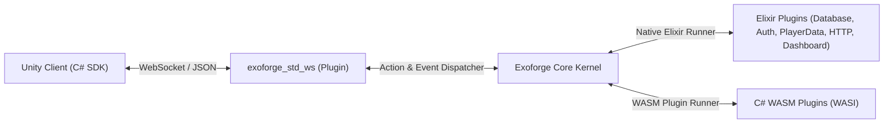

# Exoforge MVP Operating Manual (`Agents.MD`)

> **Branch**: `projetao_mvp`
> **Status**: Core Backend, 6 Standard MVP Plugins, C# Client SDK, C# Plugin SDK, **Game Producer & Designer Studio (Native Phoenix LiveView)**, and **Stateful Entity Runtime** are **COMPLETE** (**87 Elixir + 11 C# = 98 tests passing + E2E vertical slice**).
> **Next Target**: **Distributed Entity Clustering (libcluster / Horde Phase 2)** — see [`plan.md` → `## Consolidated Status & Next Steps`](file:///Users/alexcs/projects/exoforge/plan.md).

---

## 1. Executive Summary & Vision

Exoforge is a high-performance, modular game backend platform built on the Erlang/BEAM runtime. A plugin declares a service contract (`defservice` with actions, events, and schemas) and implements it; the kernel handles discovery, dependency ordering, dispatch, pub/sub, process lifecycle, and dashboard/SDK generation.

### The Completed MVP Vertical Slice


1. **Unity Client** connects via WebSocket using the Unity SDK.
2. **Client invokes an action** (e.g., `combat.attack` or `auth.authenticate`).
3. **`exoforge_std_ws`** forwards the action through [`ActionDispatcher`](file:///Users/alexcs/projects/exoforge/core/lib/action_dispatcher.ex) to a **C# WASM Plugin** or native Elixir plugin.
4. The **C# WASM Plugin** executes game logic sandboxed in WebAssembly, returns the result, and calls a host function to emit an event (e.g., `player_damaged`).
5. **Exoforge Kernel** broadcasts the event via [`EventDispatcher`](file:///Users/alexcs/projects/exoforge/core/lib/event_dispatcher.ex) back through `exoforge_std_ws`.
6. **Unity Client** receives and processes the event safely on Unity's main thread via `ExoDispatcher`.

> **Status & Verified Components**: the Elixir kernel, all 6 standard plugins, REST/WS ingress, multi-tenant DB, C# client SDK, C# plugin SDK, Native Phoenix LiveView Studio, WASM runtime, and stateful entity runtime are verified green (**87 Elixir + 11 C# = 98 tests + E2E vertical slice**). Milestones 9 and 10 are complete.
> **Next Target**: **Distributed Entity Clustering** (libcluster, Horde Phase 2). Full detail: [`plan.md` → `## Consolidated Status & Next Steps`](file:///Users/alexcs/projects/exoforge/plan.md).

---

## 2. Architectural Doctrine: The Rule, and Its One Exception

> **The Rule**: Everything above the kernel is a plugin.
> **The Exception**: The kernel itself is not a plugin.

The kernel is strictly limited to:
- [`PluginRegistry`](file:///Users/alexcs/projects/exoforge/core/lib/plugin_registry.ex)
- [`ActionDispatcher`](file:///Users/alexcs/projects/exoforge/core/lib/action_dispatcher.ex)
- [`EventDispatcher`](file:///Users/alexcs/projects/exoforge/core/lib/event_dispatcher.ex)
- [`WorkerRegistry`](file:///Users/alexcs/projects/exoforge/core/lib/worker_registry.ex)
- [`PluginSupervisor`](file:///Users/alexcs/projects/exoforge/core/lib/plugin_supervisor.ex)
- [`PluginBootstrapper`](file:///Users/alexcs/projects/exoforge/core/lib/plugin_bootstrapper.ex)
- [`Exoforge.Domain.Manifest`](file:///Users/alexcs/projects/exoforge/core/lib/domain/manifest.ex)
- The Public DSL ([`Exoforge.Plugin`](file:///Users/alexcs/projects/exoforge/core/lib/plugin.ex), [`Exoforge.Contracts.Service`](file:///Users/alexcs/projects/exoforge/core/lib/contracts/service.ex))
- Runtime and Loader Drivers ([`ManifestLoader`](file:///Users/alexcs/projects/exoforge/core/lib/drivers/loaders/manifest_loader.ex), [`ElixirPluginRunner`](file:///Users/alexcs/projects/exoforge/core/lib/drivers/runtime/elixir_plugin_runner.ex), `WasmPluginRunner`)

If the gateway, HTTP ingress, or dashboard lived in the kernel you couldn't swap them (e.g., gRPC instead of REST, raw TCP/UDP instead of WebSocket, TUI instead of web dashboard), and the bootstrapper would have a bootstrap problem. Everything else — including ingress, persistence, and UI — is a plugin.

### The 4-Question Litmus Test: "Should this be a plugin?"
1. **Can two implementations be swapped?** (REST ↔ gRPC ↔ WebSocket, Postgres ↔ SQLite, web ↔ TUI) → **Plugin**.
2. **Does something need to depend on it by contract?** → **Plugin**.
3. **Would bootstrapping itself depend on it?** → **Kernel**.
4. **Is it only consumed by one domain plugin?** → Keep it internal to that plugin.

---

### The 6 MVP Standard Plugins (Completed & Verified)

| # | Plugin | Provides | Depends on | Implementation Highlights |
| :-: | :--- | :--- | :--- | :--- |
| **1** | [`exoforge_std_database`](file:///Users/alexcs/projects/exoforge/plugins/exoforge_std_database) | `database`, `lldb` | — | Middleground between PostgreSQL/Sandbox and plugins. Strict per-plugin multi-tenant database/schema isolation. |
| **2** | [`exoforge_std_auth`](file:///Users/alexcs/projects/exoforge/plugins/exoforge_std_auth) | `auth` | `database` | Request identity, token issuance, session verification, scope enforcement. |
| **3** | [`exoforge_std_player_data`](file:///Users/alexcs/projects/exoforge/plugins/exoforge_std_player_data) | `player_data` | `database`, `auth` | Canonical player profile persistence, updates, and lifecycle events (`player_created`, `player_deleted`). |
| **4** | [`exoforge_std_http`](file:///Users/alexcs/projects/exoforge/plugins/exoforge_std_http) | `http` | `auth` | REST ingress: generic routes derived from `__service_metadata__` mounted on port 4001 via Bandit. |
| **5** | [`exoforge_std_ws`](file:///Users/alexcs/projects/exoforge/plugins/exoforge_std_ws) | `ws` | `auth` | Real-time ingress/egress: framed JSON wire protocol (`action`, `auth`, `subscribe`, `event`) on port 4000. |
| **6** | [`exoforge_std_dashboard`](file:///Users/alexcs/projects/exoforge/plugins/exoforge_std_dashboard) | `dashboard_view` | `database` | Admin UI and overview JSON API on port 4005. Litmus test that metadata is self-describing. |

### Boot Order (Topological Sort DAG)

```
database ──▶ auth ──▶ player_data
               │
               ├──▶ http
               ├──▶ ws
               │
database ──────┴──▶ dashboard
```

---

## 3. Game Producer & Designer Studio: Frontend Architecture Plan

The dashboard is being upgraded into the full **Exoforge Game Producer & Designer Studio**, visually aligned with the design specification in [`game_producer_studio_fixed.html`](file:///Users/alexcs/projects/exoforge/game_producer_studio_fixed.html).

### The Core Design Principle
> **The core platform provides the UI primitives, while extensions provide the data, capabilities, and domain-specific behavior.**
> This allows you to add a new game plugin (Guilds, Economy, Matchmaking, Inventory) without continually modifying or bloating the core dashboard application.

### The 9 Architectural Pillars

```text
Exoforge Shell (Header, Navigation, Cmd+K, Modals)
      │
      ├── Navigation & Environment Switcher
      ├── Command System (Cmd+K)
      ├── Global System Modals
      │
      ↓
Extension Registry (Metadata & Capabilities)
      │
      ├── Core Plugins (Database, Auth, PlayerData, WS, HTTP)
      ├── Game Extensions (Guilds, Economy, Balancing, Analytics)
      └── C# WASM Plugins (Combat, Loot, Simulation)
      │
      ↓
Extension Manifest & UI Definitions
      │
      ├── Resources (Schemas, Primary Keys, Filters)
      ├── Actions (Parameter inputs, Gated Scopes)
      ├── Events (Live push updates)
      └── UI Model: Declarative vs. Custom
      │
      ↓
Shared Exoforge Components
      │
      ├── Tables, Pagination, Search & Filters
      ├── Side Inspector Drawers (Tabs, Key-Value Editors)
      ├── Metric Cards, Status Badges, Toolbars
      └── Action Modals & Confirmation Dialogs
      │
      ↓
Phoenix LiveView (Real-Time Reactive BEAM)
```

1. **Build the dashboard around an Exoforge Shell**:
   - A stable, clean application shell containing the top bar, navigation, command palette (`Cmd+K`), notifications, workspace area, and global modals.
   - The shell is **strictly agnostic to individual extensions**.

2. **Make Extensions the primary modular unit**:
   - Treat Guilds, Economy, Balancing, Analytics, Localization, Player Data, etc., as independent extensions.
   - Each extension describes its identity (`name`, `version`, `icon`, `navigation`), resources, actions, events, permissions, and UI behavior.

3. **Create an Extension Registry**:
   - Integrated directly into [`PluginRegistry`](file:///Users/alexcs/projects/exoforge/core/lib/plugin_registry.ex).
   - Discovers installed extensions and exposes their metadata to LiveView.
   - The dashboard dynamically generates navigation and tools from this registry rather than having hardcoded knowledge of every plugin.

4. **Use Two UI Models**:
   - **Declarative Extensions (The Default)**:
     - Most extensions only provide metadata/schema.
     - Exoforge automatically generates standard interfaces: data tables, search/filters, pagination, inspector drawers, forms, and CRUD actions (e.g., Guilds, Economy items, Player lists).
   - **Custom Extensions (When Necessary)**:
     - Extensions like Analytics or World Maps can provide specialized UI via Phoenix LiveView (`{:live, Component}`) or JS hooks for charts, cohorts, and funnels.
     - Prevents the generic system from becoming overcomplicated.

5. **Build a Shared Exoforge Component System**:
   - Reusable platform-level LiveView components:
     - `<.table>` with sortable columns, search, and action slots.
     - `<.panel>` and `<.card>` for grouped metric and configuration layouts.
     - `<.tabs>` for navigation and panel switching.
     - `<.inspector>` slide-over drawer for deep entity inspection.
     - `<.badge>`, `<.modal>`, `<.toolbar>`, `<.metric_card>`.
     - Standard empty, loading, and error states.

6. **Use LiveView as the Default Frontend Model**:
   - All state, navigation, forms, tables, and interactions remain on the BEAM via Phoenix LiveView.
   - JavaScript is strictly limited to components requiring client-side rendering (charts, code editors, complex drag/drop).

7. **Make Plugin Metadata Drive the UI**:
   - **Resource** → Table columns, filters, inspector tabs.
   - **Action** → Buttons and auto-generated parameter forms.
   - **Event hook** → Real-time row updates pushed via [`EventDispatcher`](file:///Users/alexcs/projects/exoforge/core/lib/event_dispatcher.ex).
   - **Service** → Extension identity and RBAC scope enforcement via `exoforge_std_auth`.

8. **Keep Extensions Isolated**:
   - Extensions never directly modify the core dashboard.
   - Interaction path: `Extension → PluginRegistry → Generic Workspace → Shared Components`.

9. **Target Visual Mock Alignment (`game_producer_studio_fixed.html`)**:
   - **Theme**: Inter font, neutral slate `#f3f4f6` background, clean white cards `#ffffff` with subtle borders (`#e5e7eb`).
   - **Palette**: Purple/Violet accent (`primary-600` `#7c3aed`), live status colors (healthy `#10b981`, warning `#f59e0b`, error `#ef4444`).
   - **Global Navigation**: Overview, Players, Economy, Balancing, Guilds, Localization, Analytics, Community, App Drawer (`tab-apps`).
   - **Inspector Drawer Pattern**: Multi-tab slide-over panel (Overview, Attributes `<Key, Value>`, Transactions, Inventory, Logins & Sessions, Event Log, Moderation & Notes).
   - **Command Palette (`Cmd+K`)**: Global fuzzy search across extensions, players, and quick actions.

---

## 4. Development Commands Quick Reference

| Task | Command |
| :--- | :--- |
| **Run All Tests** | `just test` |
| **Run Core Kernel Tests** | `just test-core` |
| **Run Standard Plugin Tests** | `just test-plugins` |
| **Run Root System Integration Tests**| `just test-system` or `mix test` |
| **Run Live E2E Vertical Slice Test** | `just test-e2e` |
| **Run Backend Dev Server** | `just dev` or `mix run --no-halt` |
| **Build C# WASM Plugin** | `just build-wasm` |
| **Test C# Client SDK** | `just test-sdk` |
| **Lint & Format Elixir** | `mix format` |
| **Run in Production (Foreground)** | `just prod` |
| **Build Standalone OTP Release** | `just release` |
| **Start Production Release Daemon** | `just run-release` |
| **Stop Production Release Daemon** | `just stop-release` |
| **Build Production Container Image** | `just docker-build` |
| **Run Stack + Postgres (Compose)** | `just compose-up` |
| **Follow Compose Logs** | `just compose-logs` |
| **Stop Stack + Postgres (Compose)** | `just compose-down` |
| **Deploy to Kubernetes (Kustomize)** | `just k8s-deploy` |
| **Teardown Kubernetes Deployment** | `just k8s-destroy` |

---

## 5. Agents & Human Collaboration Guidelines

When working as an AI agent on this branch:
1. **Always read existing code before modifying**: Inspect related modules and existing contracts before introducing new abstractions.
2. **Preserve documentation & comments**: Maintain docstrings and file headers.
3. **Verify every step**: Always run the relevant test suite or build command after making changes (`just test` or `mix test`).
4. **Be explicit with links**: Link to files using `file:///` URLs with line numbers where appropriate.
5. **Keep communication focused**: Report status clearly, state what was completed, what passed verification, and the immediate next step.
6. **Honor the Rule**: Everything above the kernel is a plugin.
