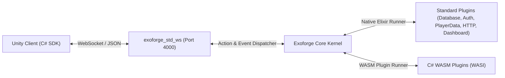

# Exoforge

> High-performance, modular game backend platform built on the Erlang/BEAM runtime.

Exoforge allows game developers to declare backend services via contracts (`defservice` with actions, events, and schemas), implement them in Elixir or C# (via WebAssembly/WASI), and have the kernel manage discovery, topological dependency ordering, pub/sub, lifecycle, REST/WebSocket ingress, and admin dashboard generation.

---

## Architecture: The Rule, and Its One Exception

- **The Rule**: Everything above the kernel is a plugin.
- **The Exception**: The kernel itself is not a plugin (`PluginRegistry`, `ActionDispatcher`, `EventDispatcher`, `WorkerRegistry`, `DrawerRegistry`, `PluginSupervisor`, `PluginBootstrapper`, `Manifest`, DSL, and drivers).

All persistence engines, ingress transports, authentication, and user interfaces are standard plugins, keeping the kernel minimal, embeddable, and swappable.

### The Completed MVP Vertical Slice



---

## Standard Plugins

| Plugin | Port / Role | Provides | Dependencies | Description |
| :--- | :--- | :--- | :--- | :--- |
| `exoforge_std_database` | Durable Storage | `database`, `lldb` | — | Per-plugin multi-tenant isolation with Postgres and Sandbox adapters. |
| `exoforge_std_auth` | Identity & RBAC | `auth` | `database` | Token issuance, session verification, and scope validation. |
| `exoforge_std_player_data` | Canonical Profiles | `player_data` | `database`, `auth` | Profile persistence and lifecycle events (`player_created`, `player_deleted`). |
| `exoforge_std_http` | REST Ingress (4001) | `http` | `auth` | Generic action routes (`/api/:service/:action`) derived from contract metadata. |
| `exoforge_std_ws` | Real-Time Sockets (4000) | `ws` | `auth` | Framed JSON wire protocol for live action dispatch and topic subscriptions. |
| `exoforge_std_dashboard` | Studio UI (4005) | `dashboard_view` | `database` | Production-grade Game Producer & Designer Studio, SSE event stream, and metadata discovery. |

---

## Developer Tooling & Commands

Exoforge includes a `Justfile` automating test execution, WASM builds, and dev server lifecycle:

```bash
# Run all test suites across Kernel, Plugins, System, and C# SDKs (66 tests)
just test

# Run Core Kernel tests
just test-core

# Run Standard Plugin tests
just test-plugins

# Run Root System integration test
just test-system

# Run C# SDK tests (Client SDK & Plugin SDK)
just test-sdk

# Build C# WASM plugin (combat_wasm)
just build-wasm

# Run live end-to-end integration test (Client -> WS :4000 -> WASM -> Event -> Client)
just test-e2e

# Start development server
just dev
```

---

## C# SDKs

1. **Client SDK (`sdk/csharp/Exoforge.Client` & `sdk/unity/Exoforge.SDK`)**:
   - WebSocket transport (`ExoTransport`), main-thread dispatcher (`ExoDispatcher`), typed wire models, and `ExoforgeBehaviour`.
   - Dual-targeted for `netstandard2.1` (Unity compatible) and `net10.0`.

2. **Plugin SDK (`sdk/csharp/Exoforge.Plugin.SDK`)**:
   - Backend plugin authoring in C# for sandboxed WASM execution.
   - Declarative attributes: `[ExoService]`, `[ExoAction]`, `[ExoEvent]`, `[ExoResource]`, `[ExoColumn]`, `[Inject]`.
   - Base classes and interfaces: `PluginBehaviour`, `IPluginContext`, `IDatabase`, `HostBridge`.

---

## Documentation

- [`AGENTS.md`](AGENTS.md): Architectural doctrine, development guidelines, and team conventions.
- [`plan.md`](plan.md): Milestone execution roadmap, audit results, and Studio architecture specification.
- [`game_producer_studio_fixed.html`](game_producer_studio_fixed.html): Visual specification for the Game Producer & Designer Studio.
