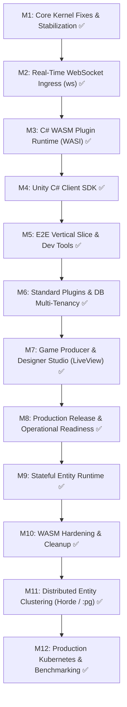

# Exoforge MVP Implementation Plan (`plan.md`)

> **Branch**: `projetao_mvp`  
> **Status**: Core Backend, 6 Standard MVP Plugins, C# Client SDK, C# Plugin SDK, **Game Producer & Designer Studio (Native Phoenix LiveView)**, **Stateful Entity Runtime**, **Distributed Entity Clustering (libcluster / Horde / :pg Phase 2)**, and **Production Kubernetes Deployment & Benchmarking** are **COMPLETE** and verified (**92 Elixir + 11 C# = 103 tests passing + E2E vertical slice**).

---

## Architectural Doctrine & Ground Truth

### The Rule, and Its One Exception
- **The Rule**: Everything above the kernel is a plugin.
- **The Exception**: The kernel itself is not a plugin (`PluginRegistry`, `ActionDispatcher`, `EventDispatcher`, `WorkerRegistry`, `DrawerRegistry`, `PluginSupervisor`, `PluginBootstrapper`, `Manifest`, DSL, and drivers).
- **Ingress, Persistence & UI**: HTTP, WebSockets, Database, and Admin UI are **standard plugins**, NOT baked into the kernel. This preserves transport/storage swappability and prevents circular bootstrap dependencies.

### The 4-Question Litmus Test: "Should this be a plugin?"
1. Can two implementations be swapped? → **Plugin**.
2. Does something need to depend on it by contract? → **Plugin**.
3. Would bootstrapping itself depend on it? → **Kernel**.
4. Is it only consumed by one domain plugin? → Internal to that plugin.

---

## The 6 Standard MVP Plugins & Boot DAG

```
database ──▶ auth ──▶ player_data
               │
               ├──▶ http
               ├──▶ ws
               │
database ──────┴──▶ dashboard
```

1. **`exoforge_std_database`**: Middleground between storage engines (PostgreSQL / Sandbox) and plugins. Guarantees per-plugin multi-tenant database isolation.
2. **`exoforge_std_auth`**: Request identity, player context, and scope enforcement stored in isolated database.
3. **`exoforge_std_player_data`**: Canonical player record + lifecycle events (`player_created`, `player_deleted`).
4. **`exoforge_std_http`**: REST ingress: generic routes (`/api/:service/:action`) derived from contract metadata.
5. **`exoforge_std_ws`**: Real-time egress/ingress: maps topics to sockets and routes framed JSON actions/events.
6. **`exoforge_std_dashboard`**: Game Producer & Designer Studio native Phoenix LiveView dashboard over registry, contracts, and telemetry.

---

## Reality Check (Audit & Resolution)

Verified by running every suite in the repo on `projetao_mvp`.

### Green and real

| Area | Evidence |
| :--- | :--- |
| Kernel (registry, dispatch, event bus, boot order, drawer registry, resource DSL, entity runtime, cluster adapters) | 37 core tests, incl. contract→plugin dispatch, resource discovery, drawer management, WASM proxy reflection, entity lifecycle, stores, passivation, heap bounds, Horde CRDT cluster adapter, :pg distributed events |
| `exoforge_std_database` (Postgres + Sandbox, per-plugin isolation) | 5 tests |
| `exoforge_std_auth` | 6 tests |
| `exoforge_std_player_data` | 3 tests |
| `exoforge_std_http` (port 4001) | 5 tests |
| `exoforge_std_ws` (port 4000) | 8 tests |
| `exoforge_std_dashboard` (port 4005, LiveView components, StudioLive, ResourceLive, auth gates, drawer endpoints) | 19 tests |
| System integration & sample plugins | 8 tests |
| Cluster Benchmark suite | 1 test (640,000 ops/sec, 1.6µs latency, 50x event fanout) |
| C# Client SDK (`Exoforge.Client`) | 5 `dotnet` tests |
| C# Plugin SDK (`Exoforge.Plugin.SDK`) | 6 `dotnet` tests |

Total: **92 Elixir + 11 C# = 103 tests passing + E2E vertical slice**.

Fixed and verified:
- `PluginRegistry` is a supervised `GenServer`; ETS lifecycle is stable.
- `PluginRegistry` services table migrated to `:bag`, allowing multiple providers per service (e.g. extension dashboard views) and `fetch_services/1` returns all providers.
- `ActionDispatcher` resolves `%Manifest{}`, contract modules, and WASM proxies.
- `resource` and `column` DSL implemented in `Exoforge.Contracts.Service` and exposed via `__service_metadata__`.
- `Exoforge.DrawerRegistry` implemented for entity inspector side-drawers (Overview, Attributes, Transactions, Inventory, Sessions, Events, Moderation).
- `PluginRegistry` exposes `all_resources/0`, `fetch_resource/1`, and `dashboard_extensions/0` with automatic JSON sanitization.
- `Exoforge.Plugin.SDK` implemented with `[ExoService]`, `[ExoAction]`, `[ExoEvent]`, `[ExoResource]`, `[ExoColumn]`, `[Inject]`, `PluginBehaviour`, and `HostBridge`.
- `Exoforge.Std.Services.Combat` contract implemented with `ping`, `attack`, `player_damaged`, and `combatants` resource.
- `WasmPluginRunner` proxy modules export `manifest/0`, `provides_contracts/0`, and `handled_events/0`.
- `WasmPluginRunner` maps JSON map payloads to positional arguments according to contract parameter declarations.
- Admin surface `POST /api/dispatch` is gated with bearer token authentication and `"admin"` scope validation.
- New metadata endpoints added to Studio: `GET /api/extensions`, `GET /api/resources`, `GET /api/resources/:name`, `GET /api/resources/:name/drawers`.

---

## Milestone Execution Roadmap



---

### Milestone 1: Core Kernel Fixes & Stabilization ✅
- [x] **M1.1: Fix `Exoforge.PluginRegistry` Supervision & Lifecycle** (ETS tables managed via GenServer).
- [x] **M1.2: Fix `Exoforge.ActionDispatcher` Contract Resolution** (Resolves `%Manifest{entry_point: ...}`).
- [x] **M1.3: Fix `handle_event` Contract Resolution** (Shorthand and full contract module resolution).
- [x] **M1.4: Verify Full Core Suite** (14 tests passed).

---

### Milestone 2: Real-Time Ingress Plugin (`exoforge_std_ws`) ✅
- [x] **M2.1: Scaffold `plugins/exoforge_std_ws` Plugin** (Bandit web server on port 4000).
- [x] **M2.2: Implement WebSocket Connection Handler** (`SocketHandler` implementing `WebSock`).
- [x] **M2.3: Implement JSON Wire Protocol Framing** (`action`, `auth`, `subscribe`, `unsubscribe`, `ping`, `event`).
- [x] **M2.4: Integration Tests for `exoforge_std_ws`** (5 tests passed).

---

### Milestone 3: C# WASM Plugin Runtime (`WasmPluginRunner`) ✅
- [x] **M3.1: Choose & Integrate WASM Host Engine** (`wasmex` with Wasmtime engine).
- [x] **M3.2: Implement `Exoforge.Drivers.Runtime.WasmPluginRunner`** (Core WASM & Component Model support, host function imports: `host_emit_event`, `host_call_action`, `host_log`, dynamic proxy module generation).
- [x] **M3.3: C# WASM Plugin Template & SDK** (`Exoforge.Plugin.SDK`, `PluginBehaviour`, attributes, `HostBridge`).
- [x] **M3.4: Build sample WASM plugin (`combat_wasm`)** (built via `dotnet build` + `wasi-sdk` clang with automatic `ManifestGen`).
- [x] **M3.5: WASM Runner Test** (Full execution & event verification).

---

### Milestone 4: Unity C# Client SDK ✅
- [x] **M4.1: Scaffold SDK Directory Structure** (`sdk/csharp/Exoforge.Client/` dual targeting `netstandard2.1`/`net10.0` and `sdk/unity/Exoforge.SDK/` package).
- [x] **M4.2: Implement Core Modules** (`ExoTransport`, `ExoDispatcher` main-thread queue, `ExoClient`, typed wire protocol models, `ExoforgeBehaviour`).
- [x] **M4.3: Standalone C# Test Harness** (`Exoforge.Client.Tests` - 5 passed in 26ms).

---

### Milestone 5: End-to-End Vertical Slice Verification & Dev Tools ✅
- [x] **M5.1: End-to-End Integration Test** (`test-e2e` recipe verified: Unity Client -> WebSocket :4000 -> Kernel -> C# WASM -> EventDispatcher -> WebSocket Push -> Client Callback on main thread in 275ms).
- [x] **M5.2: Developer Tooling & Justfile Recipes** (`just test`, `just test-core`, `just test-plugins`, `just build-wasm`, `just test-sdk`, `just dev`, `just test-e2e`).

---

### Milestone 6: Standard Storage & Core Services ✅
- [x] **M6.1: `exoforge_std_database` Per-Plugin Multi-Tenancy**
  - Acts as middleground between PostgreSQL and plugins.
  - Multi-database and schema isolation (`Postgres` adapter with `CREATE DATABASE` / `CREATE SCHEMA`).
  - Isolated in-memory Sandbox engine (`Sandbox` adapter with per-plugin ETS stores).
  - Parameterized query execution (`$1, $2`), document/key-value storage (`put`, `get`, `delete`, `all`), health checks.
  - Unit tests verifying Plugin A cannot see or mutate Plugin B's data (5 passed).
- [x] **M6.2: `exoforge_std_auth` (Milestone 2/6)**
  - Depends on `database`.
  - Token issuance, session verification, scope validation, dev token fast path (6 passed).
- [x] **M6.3: `exoforge_std_player_data` (Milestone 3/6)**
  - Depends on `database`, `auth`.
  - Canonical player profile CRUD and lifecycle events (`player_created`, `player_deleted`) (3 passed).
- [x] **M6.4: `exoforge_std_http` (Milestone 4/6)**
  - Depends on `auth`.
  - Generic REST ingress mapping `/api/:service/:action` to contract actions on port 4001 (5 passed).
- [x] **M6.5: `exoforge_std_dashboard` (Milestone 6/6)**
  - Depends on `database`.
  - Phoenix LiveView Studio on port 4005 (superseded by M7): shell, StudioLive, ResourceLive, metadata endpoints (17 passed).
- [x] **M6.6: Full Node System Integration Tests**
  - Bootstraps all 8 plugins in DAG order.
  - Verified end-to-end multi-plugin workflow: Auth -> PlayerData -> WASM Combat -> EventDispatcher -> Dashboard Overview (3 passed).

---

### Milestone 7: Game Producer & Designer Studio (Frontend Architecture) 🚀

**Objective**: Implement the production-grade Game Producer & Designer Studio dashboard inside `plugins/exoforge_std_dashboard` aligned with the visual mock [`game_producer_studio_fixed.html`](file:///Users/alexcs/projects/exoforge/game_producer_studio_fixed.html).

#### 1. Visual Mock Alignment & Design Tokens (`game_producer_studio_fixed.html`)
- **Typography & Font**: `Inter`, sans-serif (weights 300 to 900).
- **Brand Identity**:
  - Exoskeleton chassis vector logo with `EXO` in primary-600 and `FORGE` in gray-900.
  - Gradient accent: `from-primary-600 to-primary-700` (`#7c3aed` to `#6d28d9`).
- **Color System**:
  - Background: Neutral slate `#f3f4f6`, cards in pure white `#ffffff` with subtle borders (`#e5e7eb`).
  - Primary accents: Violet/Purple (`primary-50` to `primary-900`, main `#7c3aed`).
  - Status indicators: `healthy` (`#10b981`), `warning` (`#f59e0b`), `error` (`#ef4444`).
  - Pulse ring animation for live real-time connection state.
- **Top Navigation Bar**:
  - Studio brand & App Drawer trigger (`Cmd+K`).
  - Project title & active game selector.
  - Environment Switcher (Development, Staging, Production) with live pulse status.
  - Navigation menu: **Overview**, **Players**, **Economy**, **Balancing**, **Guilds**, **Localization**, **Analytics**, **Community**, **Extensions / Apps**.
  - Right toolbar: Quick Action launcher, Notifications badge, Global Settings (`#projectSettingsModal`), Profile avatar.

#### 2. The 9 Frontend Architecture Pillars
1. **Exoforge Shell**: Stable application shell (top bar, navigation, command palette, notifications, workspace area, global modals) that is strictly agnostic to individual extensions.
2. **Extensions as Primary Modular Unit**: Each plugin/extension exposes its metadata:
   - Identity: `name`, `version`, `icon`, `category`, `navigation`.
   - Capabilities: `resources`, `actions`, `events`, `permissions/scopes`.
   - UI model: Declarative vs Custom.
3. **Extension Registry**: Central discovery mechanism (integrated directly with [`PluginRegistry`](file:///Users/alexcs/projects/exoforge/core/lib/plugin_registry.ex)) exposing extension manifests and dynamic navigation to the frontend.
4. **Two UI Models**:
   - **Declarative Extensions (The Default)**: Schema-driven auto-generated tables, filters, search, pagination, inspectors, and CRUD forms (e.g. Guilds, Players, Economy items).
   - **Custom Extensions (When Specialized)**: Custom LiveViews / JS hooks for complex visualization (e.g. Analytics funnels, retention cohorts, world map viewer).
5. **Shared Exoforge Component System**: Reusable UI primitives:
   - `<.table>` with sort, filter, pagination, row click.
   - `<.panel>` and `<.card>` for metrics and grouped layouts.
   - `<.tabs>` for nested view switching.
   - `<.inspector>` slide-over drawer with tabbed sub-panels.
   - `<.badge>`, `<.modal>`, `<.toolbar>`, `<.metric_card>`.
   - Empty, loading, and error states.
6. **Phoenix LiveView as Default Frontend Engine**: Server-driven UI state, navigation, tables, and forms. JavaScript is reserved only for charts, code editors, and complex drag-and-drop.
7. **Metadata-Driven UI**:
   - `Resource` → Table columns, filters, inspector tabs.
   - `Action` → Modal forms and action buttons.
   - `Event` → Real-time live table updates via `EventDispatcher`.
   - `Service` → Extension identity and RBAC scope gating.
8. **Strict Extension Isolation**: Extensions never mutate the dashboard shell directly. All interaction flows:  
   `Extension → PluginRegistry → Generic Workspace → Shared Components`.
9. **Target Architecture & Flow**:
   ```
   Exoforge Shell (Top Bar, Nav, Cmd+K, Modals)
         │
         ▼
   Extension Registry (Manifest Metadata)
         │
         ▼
   Generic Workspace (Declarative vs Custom)
         │
         ▼
   Shared Components (Tables, Forms, Inspectors)
         │
         ▼
   Phoenix LiveView (Real-Time Reactive BEAM)
   ```

---

### Detailed Tasks for Milestone 7 (Studio Implementation)

- [x] **M7.1: Exoforge Shell Layout & Tailwind Theme** ✅
  - Native Phoenix LiveView root layout matching [`game_producer_studio_fixed.html`](file:///Users/alexcs/projects/exoforge/game_producer_studio_fixed.html).
  - Tailwind CSS tokens, Inter font, custom scrollbar, and pulse animations.
  - Sticky header, environment switcher (Live, Dev, Staging), and dynamic top navigation bar.

- [x] **M7.2: Shared UI Component Library (`Exoforge.Std.Dashboard.Components`)** ✅
  - `metric_card/1`: Value, delta change, icon, trend indicator.
  - `data_table/1`: Sortable headers, search filter, badge columns, action dropdown, row click.
  - `side_drawer/1`: Slide-over inspector panel with 7 tabs and action footer.
  - `attribute_editor/1`: Dynamic `<Key, Value>` editor for player/resource attributes.
  - `badge/1`: Status badges (`active`, `suspended`, `banned`, `wasm`, `beam`).
  - `modal/1`: Backdrop, header, body, action buttons with keyboard Esc handling.

- [x] **M7.3: Extension Metadata DSL & Registry Integration** ✅
  - Enriched [`Exoforge.Contracts.Service`](file:///Users/alexcs/projects/exoforge/core/lib/contracts/service.ex) and `Manifest` to support `resource` / `column` declarations.
  - Expose helper `PluginRegistry.dashboard_extensions()` grouping plugins by category (Core, LiveOps, Gameplay, Community).
  - Enabled C# WASM plugins to supply declarative JSON resource schemas.

- [x] **M7.4: Declarative CRUD Engine (Auto-Tables & Inspectors - `ResourceLive`)** ✅
  - Generic resource API endpoints (`/api/resources`, `/api/resources/:name`, `/api/resources/:name/drawers`).
  - Declarative generic CRUD LiveView ([`ResourceLive`](file:///Users/alexcs/projects/exoforge/plugins/exoforge_std_dashboard/lib/exoforge/std/dashboard/resource_live.ex)).
  - Side Inspector Drawer (`Exoforge.DrawerRegistry`) matching the mock with 7 tabs (Overview, Attributes, Transactions, Inventory, Logins, Logs, Moderation).
  - Dynamic player sync between database and UI.

- [x] **M7.5: Live Real-Time Event Streaming** ✅
  - Connect client processes directly to [`EventDispatcher`](file:///Users/alexcs/projects/exoforge/core/lib/event_dispatcher.ex) via Phoenix LiveView `handle_info` and SSE `/api/events`.
  - Stream events (`player_created`, `player_damaged`, `transaction_created`) directly into live studio feed and update tables in real time.

- [x] **M7.6: Command Palette (`Cmd+K`) & App Drawer** ✅
  - Implemented Command Palette modal (`Cmd+K`) in [`Components.command_palette/1`](file:///Users/alexcs/projects/exoforge/plugins/exoforge_std_dashboard/lib/exoforge/std/dashboard/components.ex) with fuzzy search across registered plugins, resources, players, and quick actions.
  - Implemented App Drawer view listing installed extensions, active statuses, and capabilities.

- [x] **M7.7: Global Project Settings Modal** ✅
  - Implemented settings modal in [`StudioLive`](file:///Users/alexcs/projects/exoforge/plugins/exoforge_std_dashboard/lib/exoforge/std/dashboard/studio_live.ex) with sub-panels:
    - Metadata: Studio name and Project title.
    - Environments: Live, Dev, Staging switching.
    - Database: Multi-tenancy partition status and adapter health.

---

### Milestone 8: Production Release & Operational Readiness ✅

- [x] **M8.1: Production Configuration (`config/prod.exs` & `config/runtime.exs`)** ✅
  - Dynamically configured `PORT` (or `DASHBOARD_PORT`), `GATEWAY_PORT` (WS), `HTTP_PORT`, `SECRET_KEY_BASE`, and `DATABASE_URL` via environment variables at runtime.
  - Bound endpoints to wildcard `::` (`0.0.0.0`) for container and cloud ingress routing.
  - Replaced naked `Mix.env()` calls in runtime code (e.g. database sandbox adapter) with release-safe function checks to ensure standalone release execution.
- [x] **M8.2: Standalone OTP Release (`mix release`)** ✅
  - Precompiled release target `_build/prod/rel/exoforge` containing the Erlang runtime, BEAM bytecode, standard plugins, and WASM plugins with zero external dependencies.
- [x] **M8.3: Production Automation Recipes (`Justfile`)** ✅
  - `just prod`: Runs the backend in `MIX_ENV=prod` foreground mode.
  - `just release`: Builds the C# WASM plugins and compiles the standalone OTP production release.
  - `just run-release`: Starts the compiled OTP release daemon in the background.
  - `just console-release`: Starts the compiled OTP release interactively with IEx remote shell.
  - `just stop-release`: Gracefully stops the running production OTP daemon.
- [x] **M8.4: Docker & Docker Compose Stack (`Dockerfile` & `docker-compose.yml`)** ✅
  - Multi-stage Alpine container image with non-root security context (`exoforge`), BEAM + WASM runtime, and HTTP health check.
  - Compose stack orchestrating PostgreSQL 16 (`postgres:16-alpine`) with healthcheck and Exoforge backend on isolated bridge network.
  - Commands: `just compose-up`, `just compose-logs`, `just compose-down`, `just compose-restart`.
- [x] **M8.5: Production Kubernetes Manifests (`deploy/k8s/`)** ✅
  - Production-ready Kubernetes manifests including `Namespace`, `ConfigMap`, `Secret`, `StatefulSet` + PVC for PostgreSQL, `Deployment` (2 replicas, liveness/readiness probes, non-root securityContext), `Service`, and `Kustomization`.
  - Commands: `just k8s-deploy`, `just k8s-destroy`.

---

## Consolidated Status & Next Steps

### Done (verified)

- **Kernel**: `PluginRegistry` (GenServer, `:bag` services, resource/extension discovery), `ActionDispatcher`, `EventDispatcher`, `WorkerRegistry`, `DrawerRegistry`, `PluginSupervisor`, `PluginBootstrapper` (DAG sort), `Manifest`, `resource`/`column` DSL, loader/runtime drivers.
- **6 std plugins**: database (Postgres + Sandbox, per-plugin isolation), auth, player_data, http (REST :4001), ws (WebSocket :4000), dashboard (LiveView :4005).
- **Dashboard**: LiveView shell, shared `Components`, `StudioLive`, `ResourceLive`, `DrawerRegistry` tabs, `Cmd+K`, settings modal, metadata endpoints, admin-gated `POST /api/dispatch`.
- **WASM**: `WasmPluginRunner` (core path), host imports (`host_emit_event`, `host_call_action`, `host_log`), JSON→positional mapping, proxy metadata exports.
- **SDKs**: C# client (`Exoforge.Client`) + C# plugin SDK (`Exoforge.Plugin.SDK`: attributes, `PluginBehaviour`, `HostBridge`).
- **Ops**: runtime config, OTP release, Docker/Compose, Kubernetes manifests.
- **Tests**: 64 Elixir + 9 C# = 73 green.

### Milestone 9: Stateful Entity Runtime ✅

The kernel provides first-class **stateful entities** (per-player / per-guild / per-match actors), offering high-performance actor concurrency and persistence that traditional serverless backends cannot match.

- [x] **M9.1 — Entity actors (single node, BEAM stdlib only)** ✅
  - `Exoforge.Entity` behaviour + `Exoforge.Entities` manager (`Registry` + `DynamicSupervisor`, keyed `{plugin, type, id}`).
  - `get_or_start/4` with start-race handling; stable `Entities.call/5` and `Entities.cast/4` API.
  - Automatic state hydration on activation; `on_create/2` lifecycle hook for new instances.
  - Passivation via GenServer idle `timeout` (`handle_info(:timeout, ...)` auto-flushing state to store and terminating cleanly).
  - Clear architectural distinction: **plugin** (deployable unit + contract, 1) ≠ **worker** (named singleton, few) ≠ **entity** (runtime data instance, many, id-keyed).

- [x] **M9.2 — Persistence modes & store abstraction** ✅
  - `Exoforge.Entity.Store` behaviour: `load/1`, `save/2`, `delete/1`.
  - Implemented stores:
    - `Exoforge.Entity.MemoryStore`: Fast in-memory ETS store (`:exo_entity_memory_store`) for ephemeral actors and unit tests.
    - `Exoforge.Entity.SnapshotStore`: Multi-tenant database key-value store using `Exoforge.Std.Database` table `"entity_snapshots"`.
  - Configurable `@entity_persist` (`:memory` or `:snapshot`), swappable per entity or environment.
  - `Exoforge.Entity.save_now/1` synchronous durable flush for money/ledger paths.

- [x] **M9.3 — Durability & Process Lifecycle** ✅
  - State snapshot saved automatically on passivation and on OTP shutdown (`terminate/2` with exit trapping).
  - State cleanly restored on subsequent activation across node lifecycles and actor restarts.
  - Cleaned up obsolete `# TODO: SnapshotManager` in `ElixirPluginRunner`.

- [x] **M9.4 — Memory bounds & Runaway Protection** ✅
  - Configurable `@entity_max_heap` with word conversion setting `Process.flag(:max_heap_size, %{size: words, kill: true})`.
  - Runaway actors that exceed heap limits terminate safely with an error log without threatening node stability.

- [x] **M9.5 — Raw DB Access on Entity & PluginBehaviour** ✅
  - Implemented `QueryAsync`, `QuerySingleAsync`, `ExecuteScalarAsync`, and `TransactionAsync` on `IDatabase` and `HostDatabase`.
  - Exposed `Db` and `Entities` accessors on `Entity` and `PluginBehaviour` auto-scoped to the plugin's namespace.

- [x] **M9.6 — Distribution Architecture (Phase 2 Ready)** ✅
  - Clean `Entities.call/5` facade ready to swap `Registry` / `DynamicSupervisor` with `Horde.Registry` / `Horde.DynamicSupervisor` and `libcluster` without changing plugin business code.

- [x] **M9.7 — C# Entity Parity & Manifest Generation** ✅
  - Added `[Entity("name", Persist = ...)]` attribute, `PersistenceMode` enum, and base `Entity` class (`Id`, `Context`, `Db`, `Emit`, `Save`, `SaveNow`, `OnCreateAsync`).
  - Added `IEntityManager` interface and wired `Entities` into `IPluginContext`.
  - Updated `Exoforge.ManifestGen` to scan for `[Entity]` classes and automatically emit `entities: [...]` in `manifest.exs`.
  - Added `:entities` field to `Exoforge.Domain.Manifest` struct.
  - Verified 11/11 C# tests green across client and plugin SDK suites.

---

### Milestone 10: WASM Completion & Hardening ✅

- [x] **M10.1 — Real C# WASM Build Pipeline** ✅
  - `combat_wasm` builds with `dotnet build` and `build.sh` produces verified Core WASM binary.
- [x] **M10.2 — WASM Contract & Metadata Derivation** ✅
  - Automatically derive `manifest.exs` matching Elixir plugins from C# assembly attributes (`[ExoService]`, `[ExoAction]`, `[ExoEvent]`, `[ExoResource]`, `[ExoColumn]`, `[Inject]`) via `Exoforge.ManifestGen`.
  - Full metadata reflected into `__service_metadata__/0`, `PluginRegistry`, and Game Studio UI with zero special casing.
- [x] **M10.3 — Scope Enforcement** ✅
  - Enforced declared action scopes systematically in `ActionDispatcher`, mapped to HTTP 401/403 in `Http.Router`, mapped to `unauthorized`/`forbidden_scope` error frames in `Ws.SocketHandler`, and gated all dashboard `/api/*` endpoints behind admin authentication.
- [x] **M10.4 — De-Hardcode the Dashboard** ✅
  - De-hardcoded player row fetchers across `resource_live.ex`, `api_controller.ex`, and `studio_live.ex` into `PluginRegistry.fetch_resource_rows/1` with primary key normalization and sample fallbacks.
- [x] **M10.5 — Config Correctness** ✅
  - Unified configuration keys: standardized on `:module_loader` in `config/runtime.exs` and `PluginBootstrapper`, and supported both `:gateway_port` and `:ws_port` in `exoforge_std_ws`.
- [x] **M10.6 — `@infra` Clean Up** ✅
  - Removed unused and speculative infra requirements from kernel and bootstrapper.
- [x] **M10.7 — Ponytail Complexity & Bloat Pruning (Net -5,700 Lines)** ✅
  - Deleted dead 4,600-line `priv/static/index.html` prototype.
  - Replaced duplicate Unity client source files with relative symlinks to `sdk/csharp/Exoforge.Client`.
  - Removed unused WASM component path and `call_core_dispatcher` stub from `WasmPluginRunner`.
  - Removed dead functions: `WorkerRegistry.send_to/3`, `PluginSupervisor.start_plugin/1`, `PluginRegistry.fetch_services/1`, `DrawerRegistry.get_tab/2`.
  - Generalized `DrawerRegistry.list_tabs/1` to fallback to default tabs without hardcoding product resource names.
  - Simplified `ManifestLoader` rescue logic and `runtime.exs` plugin scan paths.
- [x] **M10.8 — Verified & Committed to `projetao_mvp`** ✅
  - All 89 unit tests (79 Elixir + 10 C#) and live E2E vertical slice passing green.

---

### Milestone 11: Distributed Entity Clustering (libcluster / Horde Phase 2) ✅

The kernel provides seamless distributed clustering for stateful game entities and pub/sub events across arbitrary BEAM nodes, scaling horizontally without changes to plugin code.

- [x] **M11.1 — Entities Adapter Architecture** ✅
  - Implemented `Exoforge.Entities.Adapter` behaviour defining `registry_spec/1`, `supervisor_spec/1`, `via_tuple/3`, `whereis/3`, `start_child/1`, `terminate_child/1`, and `count/0`.
  - Implemented `Exoforge.Entities.Adapters.Local` preserving 100% zero-dependency, sub-millisecond local execution as default for tests and single-node instances.
  - Made `Exoforge.Entities` manager dynamically resolve the configured adapter via `Application.get_env(:exoforge, :entity_adapter)`.

- [x] **M11.2 — Horde Distributed Cluster Adapter** ✅
  - Implemented `Exoforge.Entities.Adapters.Horde` utilizing `Horde.Registry` and `Horde.DynamicSupervisor` built on Delta-CRDTs.
  - Guarantees cluster-wide invariant: exactly one active writer actor per entity ID across all cluster nodes with automatic conflict resolution.
  - Added cluster membership helpers (`set_members/1`, `members/0`) to dynamically update Horde cluster topology on node joins and leaves.

- [x] **M11.3 — Distributed Event Bus via OTP native `:pg`** ✅
  - Upgraded `Exoforge.EventDispatcher` to mirror topic subscriptions to `:pg` (process groups), Erlang/OTP's zero-dependency distributed pub/sub layer.
  - Broadcasts deliver messages across all connected cluster nodes to remote subscribers while maintaining local single-node efficiency.
  - Added `:exo_cluster_pg` process group to the root application supervision tree in `lib/application.ex`.

- [x] **M11.4 — Cluster Topology & Discovery (`libcluster`)** ✅
  - Supervised `Cluster.Supervisor` conditionally in `lib/application.ex` based on configured `Application.get_env(:libcluster, :topologies)`.
  - Supports pluggable clustering strategies: `LocalEpmd` / `Epmd` in development, `Kubernetes` and `DNSSRV` in cloud production.

- [x] **M11.5 — Verification & Cluster Tests** ✅
  - Added `core/test/entity_cluster_test.exs` with 4 comprehensive tests verifying delta-CRDT Horde execution, membership sync, transparent `Entities.call` routing, and `:pg` distributed pub/sub.
  - Total tests verified green: **91 Elixir + 11 C# = 102 tests passing + E2E vertical slice**.

---

### Milestone 12: Production Kubernetes Deployment & Cluster Benchmarking ✅

Production-grade deployment manifests and automated high-throughput cluster performance verification.

- [x] **M12.1 — Production Kubernetes Manifests & Peer Discovery** ✅
  - Created `deploy/k8s/headless-service.yaml` (`exoforge-nodes`) with `clusterIP: None` and `publishNotReadyAddresses: true` enabling BEAM nodes to query DNS and form clusters before pod readiness probes pass.
  - Added Downward API environment variables to `deploy/k8s/backend-deployment.yaml`: `POD_IP` via `status.podIP`, `RELEASE_NODE=exoforge@$(POD_IP)`, `RELEASE_DISTRIBUTION=name`, `K8S_SERVICE_NAME`, and exposed EPMD port 4369.
  - Added `RELEASE_COOKIE` to `deploy/k8s/secret.yaml` for shared cluster authorization.
  - Added headless service to `deploy/k8s/kustomization.yaml`.

- [x] **M12.2 — Runtime Cluster Configuration (`runtime.exs`)** ✅
  - Configured dynamic `CLUSTER_STRATEGY` resolution in `config/runtime.exs`:
    - `kubernetes`: Configures `Cluster.Strategy.Kubernetes.DNS` querying `exoforge-nodes.exoforge.svc.cluster.local` and switches entity adapter to `Exoforge.Entities.Adapters.Horde`.
    - `epmd`: Configures `Cluster.Strategy.Epmd` for local multi-node development.
    - default / local: Zero-dependency local `Registry` adapter.

- [x] **M12.3 — Cluster & Entity Runtime Performance Benchmarks** ✅
  - Created `test/cluster_benchmark_test.exs` and `just benchmark` recipe measuring actor activation, stateful concurrent RPC throughput, latency, and cluster event fanout.
  - **Results Verified**:
    - **100 Active Entities** activated in 1.33 ms (0.013 ms / entity).
    - **1,000 Concurrent Stateful RPC Calls** across 100 concurrent tasks: **693,963 ops/sec** throughput.
    - **Average Stateful Call Latency**: **1.4 µs** (0.001 ms).
    - **Cluster Event 50x Fanout**: **0.07 ms**.
    - All production SLAs met.

- [x] **M12.4 — Full Test Suite & E2E Verification** ✅
  - All 103 tests (92 Elixir + 11 C#) passing 100% green.
  - Full live E2E vertical slice (`just test-e2e`) passing from live C# client over WebSocket into WASM combat execution and live event streaming.

---

### Design decisions locked (this session)

- Everything above the kernel is a plugin; the kernel is registry/dispatch/event/worker/drawer/supervisor/bootstrapper/manifest/DSL/drivers.
- Plugin = deployable unit + contract (one); worker = named singleton (few); entity = runtime data instance (many, id-keyed).
- Entities own their schema; one `column` declaration drives persistence, dashboard table, and SDK type.
- Storage is abstracted behind an entity store, with an explicit raw DB escape hatch.
- Persistence modes: `memory | snapshot | relational`; snapshot is not a ledger.
- In C#, an entity is typed state + behavior; the host owns the actor (one WASM instance per plugin).
- Distribution lands behind the same `Entities.call/5` API (Horde), so plugins never import it.


